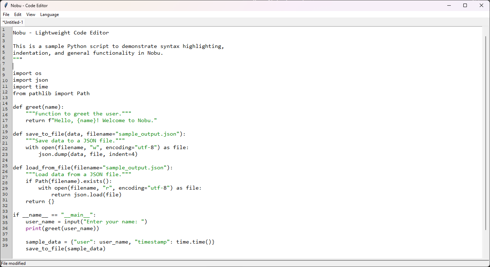

# Nobu - A Lightweight Python-based Code Editor

Nobu is a lightweight, customizable, and cross-platform text editor built with Python and Tkinter. It supports syntax highlighting for multiple programming languages, auto-saving, zooming, and more. Whether you're writing code, editing text files, or working on HTML/CSS/JS projects, Nobu is designed to make your workflow smoother.

---

## Features

- **Syntax Highlighting**: Supports Python, HTML, CSS, JavaScript, and JSON.
- **Multiple Themes**: Choose from light, dark, and default themes.
- **Auto-Save**: Automatically saves your work at regular intervals.
- **Zoom In/Out**: Easily adjust the text size for better readability.
- **Find & Replace**: Quickly search and replace text within your document.
- **Line Numbers**: Displays line numbers for better navigation.
- **Multiple Tabs**: Work on multiple files simultaneously with a tabbed interface.
- **Customizable Fonts**: Change the font and font size to suit your preferences.
- **Keyboard Shortcuts**: Intuitive shortcuts for common actions (e.g., `Ctrl+S` to save).

---

## Installation

To use Nobu, ensure you have Python 3.x installed on your system. Follow these steps:

1. Clone the repository:
   ```bash
   git clone https://github.com/HoshiyoShiro/Nobu.git
   cd Nobu
   ```

2. Install the required dependencies:
   ```bash
   pip install -r requirements.txt
   ```

3. Run the editor:
   ```bash
   python nobu.py
   ```

---

## Usage

- **Create a New File**: `Ctrl+N` or `File > New`
- **Open a File**: `Ctrl+O` or `File > Open`
- **Save a File**: `Ctrl+S` or `File > Save`
- **Change Themes**: `View > Themes`
- **Zoom In/Out**: `Ctrl++` (Zoom In), `Ctrl+-` (Zoom Out), `Ctrl+0` (Reset Zoom)
- **Find & Replace**: `Ctrl+F` to open the dialog

---

## Supported Languages

- Python (`.py`)
- HTML (`.html`)
- CSS (`.css`)
- JavaScript (`.js`)
- JSON (`.json`)
- Plain Text (`.txt`)

---

## Screenshots

  <!-- Add a screenshot of the editor -->

---

## License

This project is licensed under the GNU General Public License v3.0. See the [LICENSE](LICENSE) file for details.

---

## Acknowledgments

- Built with [Tkinter](https://docs.python.org/3/library/tkinter.html).
- Inspired by modern code editors like Notepad++ and Sublime Text.

---

## Contact

If you have any questions or suggestions, feel free to reach out:

- **GitHub**: [HoshiyoShiro](https://github.com/HoshiyoShiro)

---
